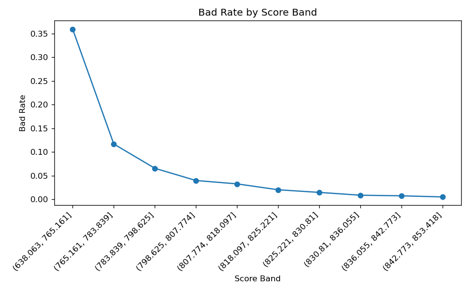

# Credit Default Risk Scorecard — Give Me Some Credit

A full credit-scoring pipeline that predicts the probability of serious delinquency and
converts a logistic regression into an interpretable, points-based **scorecard** — the
standard model form used in retail credit risk.

Built on the Kaggle *Give Me Some Credit* dataset (150,000 borrowers).

## Results

| Metric | Train | Test (30% hold-out) | 5-fold CV |
|--------|:-----:|:-------------------:|:---------:|
| AUC    | 0.855 | 0.856               | 0.855 ± 0.007 |
| Gini   | 0.711 | 0.712               | — |
| KS     | 0.557 | 0.556               | — |

Train ≈ Test ≈ CV → the model generalizes; there is no overfitting. For credit scoring,
KS > 0.4 and Gini > 0.5 are considered strong discrimination.

## Key findings

- **Strong, stable discrimination.** AUC 0.86 / Gini 0.71 / KS 0.56, near-identical across
  train, hold-out, and 5-fold cross-validation — the WoE + logistic design generalizes cleanly
  rather than memorizing the training split.
- **Risk is driven by delinquency history.** The largest scorecard weights fall on payment
  behaviour (times 90 days late, times 30–59 days late), followed by revolving utilization and
  debt ratio. Monthly income and number of dependents are the weakest predictors.
- **A missing delinquency record is itself a signal.** The flag marking sentinel values (96/98)
  in the 90-days-late field carries the single largest coefficient — an irregular or absent
  payment record is strongly associated with default, so the missingness is modelled explicitly
  rather than discarded.
- **The scorecard rank-orders risk.** On the hold-out set the observed bad rate falls
  monotonically across score deciles — from 35.9% in the lowest band to 0.5% in the highest —
  confirming the score cleanly separates good from bad borrowers (a standard model-validation
  check).



*Bad rate by score decile on the hold-out set — monotonically decreasing, i.e. higher score =
lower risk.*

## Methodology

1. **Cleaning & feature engineering.** Sentinel / invalid values (income = 0 or 1, past-due
   counts = 96/98, age = 0) are treated as missing and flagged; missing numerics are imputed by
   age-group median; `DebtRatio` is kept as an explicit *Missing* group when income is absent;
   heavy-tailed fields are clipped and `DebtRatio` is log-transformed for stability.
2. **WoE / IV encoding.** Every feature is binned and mapped to its Weight of Evidence, with
   missing values forming their own WoE bin rather than being dropped. This is the standard
   credit-scoring encoding: monotonic, interpretable, and robust to outliers.
3. **Model.** Logistic Regression on the WoE-encoded features — the interpretable,
   regulator-friendly choice for scorecards — with 11 features retained.
4. **Evaluation.** AUC, Gini, and KS, plus 5-fold cross-validation for stability.
5. **Scorecard.** The fitted log-odds are converted to a points-based score in the 300–850 style
   (PDO = 20, base 600 at 50:1 odds), so each feature bin contributes additive points.
6. **Validation.** A decile rank-ordering / monotonicity check on the hold-out set.

## Repository structure

```
.
├── GMSC.ipynb          # the full pipeline, end to end
├── data/               # place the Kaggle CSVs here (not committed)
├── figures/            # generated plots
├── outputs/            # generated Kaggle submission
├── requirements.txt
├── .gitignore
├── LICENSE
└── README.md
```

## Setup

```bash
pip install -r requirements.txt
```

## Data

The dataset is **not** redistributed here (Kaggle competition rules). Download it from the
[Give Me Some Credit competition](https://www.kaggle.com/c/GiveMeSomeCredit/data) and place the
files so the folder looks like:

```
data/
├── cs-training.csv
└── cs-test.csv
```

Then run `GMSC.ipynb` top to bottom. It reads from `data/`, writes plots to `figures/`, and the
Kaggle submission to `outputs/`.

## Note on the cross-validation figure

WoE tables are learned on the full training split before the cross-validation split, so the
reported CV AUC carries a small optimistic bias. The independent 30% hold-out AUC (0.856), which
the model never sees during fitting, confirms the result is not driven by leakage.
